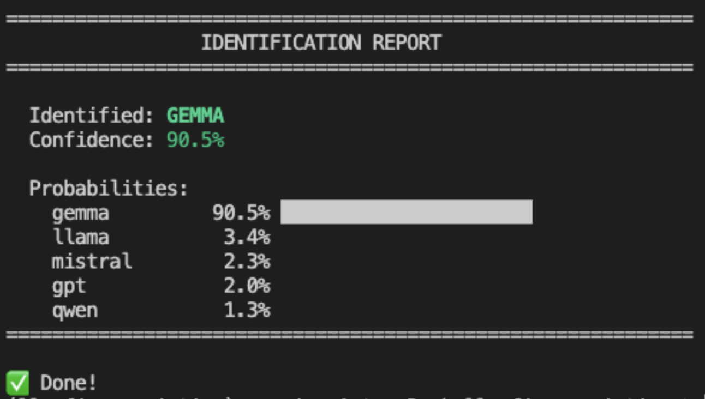
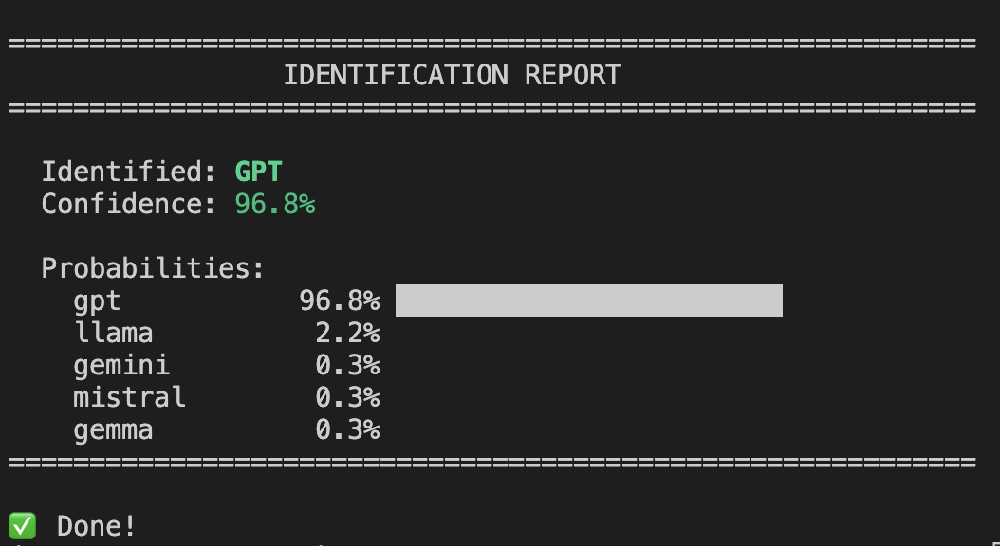

# LLM Fingerprinting System

A black-box fingerprinting system that identifies the underlying LLM model family (GPT, LLaMA, Mistral, etc.) by analyzing response patterns across 75 discriminative prompts. The system can identify fine-tuned models as well, tracing them back to their foundational base model.

**Note: Check config.py to see all identifiable model families** 

You can find an *already* NLP trained model in the `model` directory.

 

## Supported Backends

| Backend | Description | API Key Required |
|---------|-------------|------------------|
| `ollama` | Local Ollama instance | ❌ No |
| `ollama-cloud` | Ollama Cloud API | ✅ `OLLAMA_CLOUD_API_KEY` |
| `openai` | OpenAI API (or compatible) | ✅ `OPENAI_API_KEY` |
| `gemini` | Gemini API (or compatible) | ✅ `GEMINI_API_KEY` |
| `deepseek` | Deepseek API (or compatible) | ✅ `DEEPSEEK_API_KEY` |
| `custom` | Custom HTTP request | ✅ `CUSTOM_API_KEY` |

## Installation

```bash
pip install -r requirements.txt

# Or install as a package
pip3 install -e .

# Optional: Download NLTK data for text processing
python -c "import nltk; nltk.download('punkt_tab'); nltk.download('stopwords')"
```

## Quick Start

### Ollama

```bash
# Identify model and fine-tuning

llm-fingerprinter identify -b ollama --model some-model 

# Train your own classifier
# Fingerprint the LLM
llm-fingerprinter simulate --model llama3.2 --family llama
# Train on the Fingerprints
llm-fingerprinter train

```
### Custom - Interact with any LLM via HTTP request

```bash
llm-fingerprinter identify -r ./custom_request.txt --api-key <API_KEY>
# Example of custom request inside the example folder
```

### Ollama Cloud

```bash
export OLLAMA_CLOUD_API_KEY="your-key"
llm-fingerprinter simulate -b ollama-cloud --model llama3.2 --family llama
```

### OpenAI

```bash
export OPENAI_API_KEY="your-key"
llm-fingerprinter simulate -b openai --model gpt-4 --family gpt
```

### Gemini

```bash
export GEMINI_API_KEY="your-key"
llm-fingerprinter simulate -b gemini --model gemini-2.5-pro --family gpt
```

### Deepseek

```bash
export DEEPSEEK_API_KEY="your-key"
llm-fingerprinter simulate -b deepseek --model deepseek-v3.2 --family deepseek
```

### Custom API

```bash
export CUSTOM_API_KEY="your-key"
llm-fingerprinter simulate -b custom -e http://your-api.com/v1 --model your-model --family llama
```

---

## Commands

### Backend Options (all LLM commands)

| Option | Short | Default | Description |
|--------|-------|---------|-------------|
| `--backend` | `-b` | `custom` | Backend: `ollama`, `ollama-cloud`, `openai`,`deepseek`,`gemini` ,`custom`|
| `--endpoint` | `-e` | auto | API endpoint URL |
| `--api-key` | `-k` | env var | API key |

### `simulate`

Run fingerprinting simulations for training data.

```bash
llm-fingerprinter simulate [OPTIONS]
```

| Option | Default | Description |
|--------|---------|-------------|
| `--model` | *required* | Model name |
| `--family` | *required* | Family: `gpt`, `claude`, `llama`, `gemini`, `mistral`, `qwen`, `gemma` |
| `--num-sims` | *optional* | Number of simulations |
| `--repeats` | *optional* | Prompt repeats per simulation |

**Examples:**
```bash
# Ollama local
llm-fingerprinter simulate --model llama3.2 --family llama

# Ollama Cloud
llm-fingerprinter simulate -b ollama-cloud --model llama3.2 --family llama

# OpenAI
llm-fingerprinter simulate -b openai --model gpt-4 --family gpt --num-sims 5

# Custom endpoint
llm-fingerprinter simulate -b openai -e https://api.groq.com/openai/v1 -k $GROQ_KEY --model llama-3.1-70b --family llama
```

### `train`

Train classifier from saved fingerprints.

```bash
llm-fingerprinter train [--augment/--no-augment]
```

### `identify`

Identify model family using trained classifier.

```bash
llm-fingerprinter identify --model <model-name> [-b <backend>]
```

# Other commands
### `list-models`

List available models on the API.

```bash
llm-fingerprinter list-models [-b <backend>]
```

### `list-fingerprints`

List saved fingerprints by family.

```bash
llm-fingerprinter list-fingerprints
```

### `info`

Show configuration and status.

```bash
llm-fingerprinter info
```

---

## Environment Variables

| Variable | Backend | Description |
|----------|---------|-------------|
| `OLLAMA_CLOUD_API_KEY` | ollama-cloud | Ollama Cloud API key |
| `OPENAI_API_KEY` | openai | OpenAI API key |
| `GEMINI_API_KEY` | gemini | Gemini API key |
| `DEEPSEEK_API_KEY` | deepseek | DeepSeek API key |
| `CUSTOM_API_KEY` | custom | Custom API key |
| `LOG_LEVEL` | all | Logging level (DEBUG, INFO, etc.) |


## How It Works

1. **75 Prompts** across 3 layers:
   - *Stylistic*: Analyze writing style and formatting preferences
   - *Behavioral*: Assess response patterns and decision-making behavior
   - *Discriminative*: Identify model-specific characteristics and inconsistencies

2. **Feature Extraction**: 384-dim embeddings + 12 linguistic + 6 behavioral features
3. **PCA** reduction to 64 dimensions (Optional)
4. **Ensemble Classification**: Random Forest (45%) + SVM (45%) + MLP (10%)

---

## Contributing

Contributions are welcome! Whether you're adding support for new models, improving accuracy, or extending to additional clients, please see [CONTRIBUTING.md](CONTRIBUTING.md) for guidelines.

---

## License

MIT License

